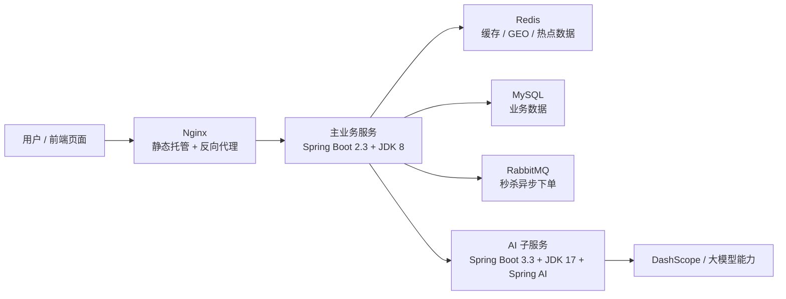
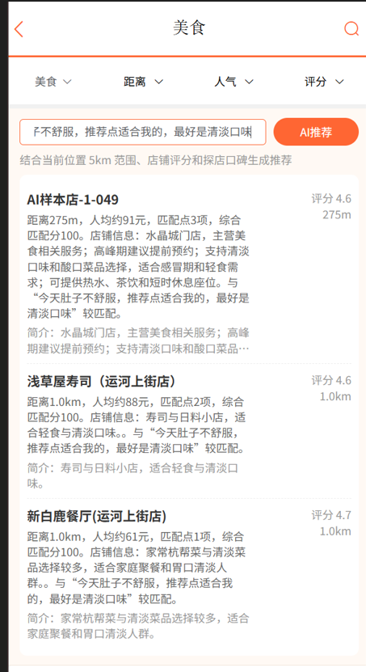
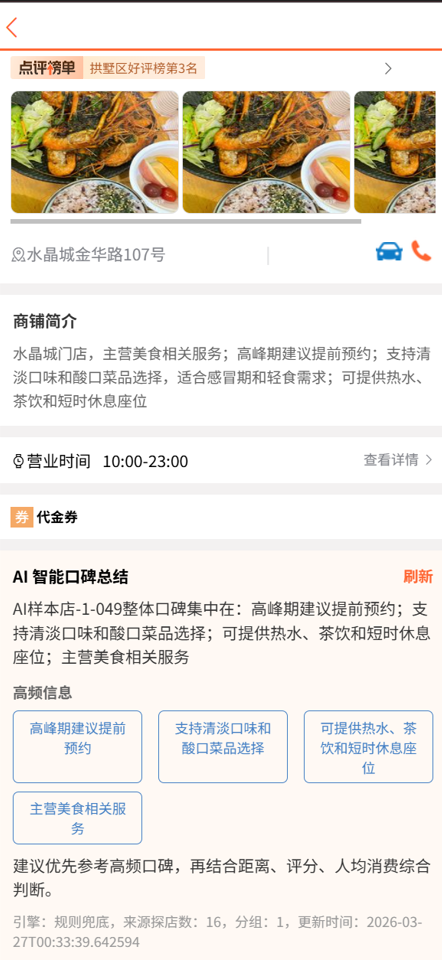
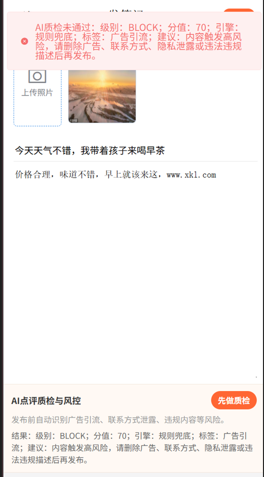

<!-- github-markdown.md -->

<div align="center">

# 优探乐享生活 · AI 本地生活服务平台

<p>
  一个从 0 到 1 自主设计与开发的本地生活服务平台。<br/>
  覆盖探店笔记、附近好店、优惠券秒杀等完整业务链路，并通过独立 Sidecar AI 子服务把大模型能力深度融入业务。
</p>

<p>
  
  
  
  
  
</p>

<p>
  
  
  
  
</p>

</div>

---

## 项目简介

优探乐享生活是一个面向本地生活场景的综合服务平台，目标是让用户用一句自然语言就能找到附近合适的店，也能通过真实探店笔记了解一家店的真实口碑。

平台在设计之初就把大模型能力作为一等公民，但没有让前端直接调用模型，也没有把模型 SDK 塞进核心业务服务，而是采用 Sidecar 架构独立部署 AI 子服务：

- 主业务服务负责数据检索、Redis 缓存、GEO 搜索、业务规则与接口编排，基于 `Spring Boot 2.3 + JDK 8`，稳定优先
- AI 子服务负责意图解析、分段总结、重排、推荐理由生成与风控判断，基于 `Spring Boot 3.3 + JDK 17 + Spring AI`，独立演进、可随时切换模型供应商
- 模型超时或不可用时，主服务与 AI 服务两侧都有本地规则兜底，主链路不中断

当前仓库包含：

1. 主业务后端：`dianping-nginx-1.18.0`
2. 前端静态页面与 Nginx：`dianping-nginx-1.18.0/nginx-1.18.0 dianping`
3. AI 子服务：`hmdp-ai-service`
4. 一键初始化数据库脚本：`sql/open-source-full-init.sql`

（如果项目对你有帮助，可以给个 star 吗？😻😻😻🥰🥰🥰）

---

## 功能全景

### 业务模块

- 手机号 + 短信验证码登录，基于 Redis 的双拦截器会话刷新
- 商户分类、商户详情、附近商户（Redis GEO 检索 + 数据库兜底）
- 探店笔记发布、点赞、按时间滚动分页、热门榜单
- 用户关注 / 取关、共同关注、关注信息流
- 优惠券领取、优惠券秒杀下单
- 图片上传与 Nginx 静态托管

### 三大 AI 场景

<table>
  <tr>
    <td width="50%">
      <strong>AI 店铺口碑总结</strong><br/>
      按店铺聚合探店笔记，分段摘要后再聚合为完整口碑，支持指纹失效与多级缓存。
    </td>
    <td width="50%">
      <strong>AI 探店助手</strong><br/>
      自然语言表达需求，结合 5km 范围、店铺简介、口碑与距离给出个性化推荐。
    </td>
  </tr>
  <tr>
    <td width="50%">
      <strong>AI 笔记质检与风控</strong><br/>
      识别广告引流、联系方式、隐私泄露、违法违禁、人身攻击等风险内容。
    </td>
    <td width="50%">
      <strong>双层兜底设计</strong><br/>
      模型失败时，主服务与 AI 服务都可回退到本地规则，链路不中断。
    </td>
  </tr>
</table>

---

## 架构设计

整体调用链路：



AI 子服务独立拆分的原因：

1. 核心业务服务保持 `Spring Boot 2.3 + JDK 8` 技术底座，不为模型 SDK 做整体升级
2. AI 子服务单独使用 `Spring Boot 3.3 + JDK 17 + Spring AI`，迭代节奏独立
3. 大模型供应商可独立切换，不影响主业务
4. 模型超时或不可用时，可在主服务和 AI 服务两侧同时兜底

API Key 通过环境变量读取，不提交到仓库。

---

## 技术栈

### 主业务服务

- Spring Boot 2.3.12 / Java 8
- MyBatis-Plus
- MySQL
- Redis、Redisson
- RabbitMQ
- Nginx 静态托管 + 反向代理

### AI 子服务

- Spring Boot 3.3.5 / Java 17
- Spring AI 1.0.0
- 阿里云 DashScope 模型接入

---

## 仓库结构

```text
.
├─ README.md
├─ 项目理解文档.md
├─ sql/
│  └─ open-source-full-init.sql
├─ dianping-nginx-1.18.0/
│  ├─ pom.xml
│  ├─ src/main/java/com/hmdp
│  ├─ src/main/resources/application.yaml
│  ├─ src/main/resources/db/
│  └─ nginx-1.18.0 dianping/
│     ├─ conf/nginx.conf
│     └─ html/
└─ hmdp-ai-service/
   ├─ pom.xml
   ├─ src/main/java/com/hmdp/ai
   └─ src/main/resources/application.yaml
```

---

## 核心设计

### 1. AI 店铺口碑总结

- 数据来源：`tb_blog`，按店铺聚合探店笔记
- 处理方式：先做 chunk summary（分段摘要），再做 final summary（聚合总结）
- 缓存策略：分组缓存 + 总结缓存 + 指纹校验（博客变化时缓存自动失效）
- 模型不可用时回退到本地规则版总结
- 对外接口：`GET /ai/shop/{shopId}/summary`
- 页面入口：`shop-detail.html`

### 2. AI 探店助手

- 输入：用户自然语言需求 + 当前坐标 + 当前店铺类型
- 意图解析：大模型提取意图摘要、类型关键词、包含 / 排除关键词
- 候选召回：Redis GEO 优先（5km 范围），查不到时 DB 兜底
- 排序：本地规则粗排 → 大模型重排 → 大模型生成推荐理由
- 关键上下文：`tb_shop.shop_desc` 店铺简介字段，承载口味、环境、服务等模型可理解的经营信息
- 结果缓存：相同需求短时间内直接复用推荐结果
- 对外接口：`POST /ai/assistant/recommend`
- 页面入口：`shop-list.html`

### 3. AI 笔记质检与风控

- 前端在发笔记页先做一次 AI 预检，即时反馈给用户
- 后端 `POST /blog` 保存前再强制做一次 AI 风控校验（前端不是安全边界）
- 识别范围：广告引流、联系方式泄露、隐私泄露、违禁违法、辱骂攻击、夸大营销
- 模型不可用时走本地关键词规则兜底
- 对外接口：`POST /ai/review/risk-check`
- 页面入口：`blog-edit.html`

### 4. 优惠券秒杀

- Redis + Lua 完成库存校验与一人一单判断的原子操作
- 通过 RabbitMQ 异步投递订单消息，消费者结合 Redisson 锁与事务落库
- 正常队列消费失败后进入死信队列兜底
- 全局唯一订单号由 Redis 号段模式生成

---

## 功能演示

<div align="center">
  <table>
    <tr>
      <td align="center">
        <strong>AI 探店助手</strong><br/><br/>
        
      </td>
      <td align="center">
        <strong>AI 店铺口碑总结</strong><br/><br/>
        
      </td>
      <td align="center">
        <strong>笔记校验 / AI 风控</strong><br/><br/>
        
      </td>
    </tr>
  </table>
</div>

> 三张图片顺序分别对应：AI 探店助手、AI 店铺口碑总结、笔记校验。

---

## 快速启动

### 1. 环境准备

- JDK 8（主业务服务）
- JDK 17（AI 子服务）
- Maven 3.9+
- MySQL 5.7+ 或 8.x
- Redis 6+
- RabbitMQ 3.x
- Nginx 1.18+

### 2. 初始化数据库

导入根目录 SQL：

```text
sql/open-source-full-init.sql
```

脚本会完成：

1. 创建 `hmdp` 数据库
2. 创建完整业务表结构
3. 创建 `tb_shop.shop_desc` 店铺简介字段
4. 导入基础演示数据
5. 额外导入 30 家美食类 AI 测试店铺
6. 为这 30 家店铺生成 14 到 22 条探店笔记样本，并预置互动量用于 AI 演示

### 3. 修改主业务服务配置

文件：

```text
dianping-nginx-1.18.0/src/main/resources/application.yaml
```

按需确认：`server.port`、数据源、Redis、RabbitMQ 连接信息，以及 `hmdp.ai.base-url`（AI 子服务地址）。

默认端口规划：

- 主业务服务：`8081`
- AI 子服务：`8090`

### 4. 配置 AI 子服务

文件：

```text
hmdp-ai-service/src/main/resources/application.yaml
```

模型配置从环境变量读取：

```bash
set DASHSCOPE_API_KEY=你的DashScope API Key
set DASHSCOPE_MODEL=qwen-turbo-flash
```

如需改端口：

```bash
set HMDP_AI_PORT=8090
```

### 5. 修改图片上传目录

文件：

```text
dianping-nginx-1.18.0/src/main/java/com/hmdp/utils/SystemConstants.java
```

将 `IMAGE_UPLOAD_DIR` 改成本机实际存在的前端 `imgs` 目录路径，否则图片上传会写入错误位置。

### 6. 检查 Nginx 代理

文件：

```text
dianping-nginx-1.18.0/nginx-1.18.0 dianping/conf/nginx.conf
```

默认约定：

- Nginx 端口：`8080`
- `/api/**` 反向代理到 `http://127.0.0.1:8081`

前端请求基址为 `axios.defaults.baseURL = "/api"`，请通过 Nginx 访问页面。

### 7. 启动顺序

1. 启动 MySQL、Redis、RabbitMQ
2. 导入 `sql/open-source-full-init.sql`
3. 启动 AI 子服务
4. 启动主业务服务
5. 启动 Nginx

启动命令：

```bash
# AI 子服务
cd hmdp-ai-service
mvn spring-boot:run

# 主业务服务
cd dianping-nginx-1.18.0
mvn spring-boot:run

# Nginx
cd "dianping-nginx-1.18.0/nginx-1.18.0 dianping"
start nginx.exe
```

访问地址：

- 前端首页：`http://127.0.0.1:8080`
- 主业务服务：`http://127.0.0.1:8081`
- AI 子服务：`http://127.0.0.1:8090`

---

## Redis 预热

数据库初始化不会自动写入 Redis。平台提供两种方式保证 Redis 数据可用：

1. 业务访问时按需回填
2. 使用 `DemoDataSeedRunner` 提前预热 GEO 数据与店铺缓存并校验

在 IDE 中运行 `DemoDataSeedRunner` 即可在导入 SQL 后把 GEO、店铺缓存等提前写入 Redis。

---

## 关键代码入口

### 主业务服务

- AI 控制器：`dianping-nginx-1.18.0/src/main/java/com/hmdp/controller/AiController.java`
- AI 编排核心：`dianping-nginx-1.18.0/src/main/java/com/hmdp/service/impl/AiServiceImpl.java`
- AI 子服务客户端：`dianping-nginx-1.18.0/src/main/java/com/hmdp/ai/client/AiRemoteClientImpl.java`
- Redis Key 常量：`dianping-nginx-1.18.0/src/main/java/com/hmdp/utils/RedisConstants.java`
- 笔记发布风控拦截：`dianping-nginx-1.18.0/src/main/java/com/hmdp/controller/BlogController.java`
- 秒杀下单：`dianping-nginx-1.18.0/src/main/java/com/hmdp/service/impl/VoucherOrderServiceImpl.java`

### AI 子服务

- 接口入口：`hmdp-ai-service/src/main/java/com/hmdp/ai/controller/InternalAiController.java`
- 提示词与兜底实现：`hmdp-ai-service/src/main/java/com/hmdp/ai/service/AiOrchestrationService.java`

### 前端

- 店铺详情 AI 总结：`dianping-nginx-1.18.0/nginx-1.18.0 dianping/html/hmdp/shop-detail.html`
- 店铺列表 AI 助手：`dianping-nginx-1.18.0/nginx-1.18.0 dianping/html/hmdp/shop-list.html`
- 发笔记 AI 风控：`dianping-nginx-1.18.0/nginx-1.18.0 dianping/html/hmdp/blog-edit.html`
